# Flight Reservation System

This is a Flight Reservation System developed using [React](https://reactjs.org/) for the frontend and [Node.js](https://nodejs.org/) with [Express](https://expressjs.com/) for the backend. It allows users to search for flights, view available flights based on various parameters, and book tickets.

## Features

- **User Authentication:** Sign up and login functionalities for users.
- **Search Flights:** Search and filter flights based on airline, source, destination, date, and class.
- **Book Flights:** Reserve seats for desired flights.
- **View Ticket Details:** See the details of booked tickets.
- **Responsive Design:** The application is responsive and works well on different devices.

## Technologies Used

- Frontend:
  - React.js
  - React Router DOM for routing
  - HTML, CSS

- Backend:
  - Node.js
  - Express.js
  - MongoDB for database

## Setup Instructions

1. Clone the repository: `git clone https://github.com/the-Sunny-Sharma/MIRA_airline_reservation_system.git`
2. Navigate to the project directory: `cd airline-reservation`
3. Install dependencies for frontend: `cd client && npm install`
4. Install dependencies for backend: `cd ../server && npm install`
5. Start the backend server: `nodemon index.js`
6. Start the frontend server: `npm start`

Make sure to set up MongoDB with appropriate configurations for the backend to connect to the database.

## Usage

1. Create an account or log in to the system.
2. Search for flights by selecting the source, destination, date, and airline preference.
3. Choose a flight and book tickets by specifying the number of passengers and class.
4. View the booked tickets and their details.

## Screenshots

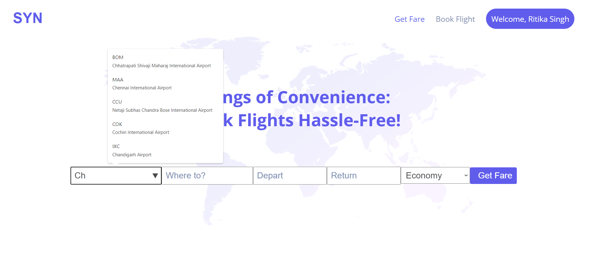
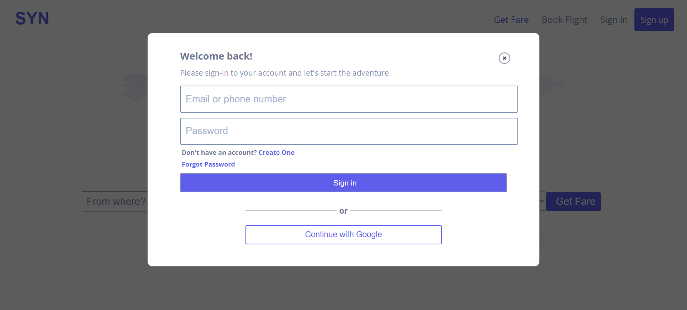
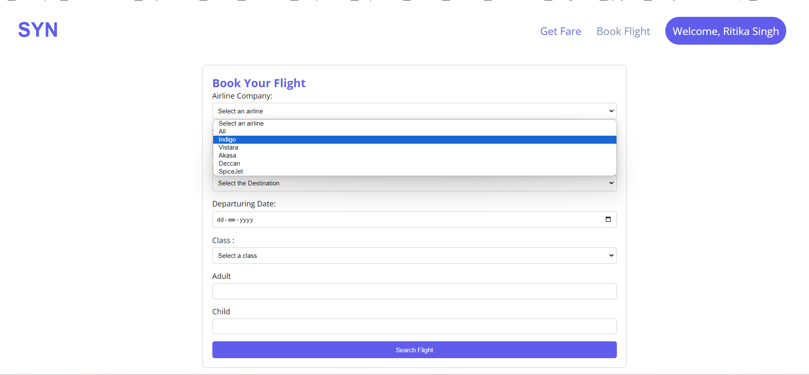
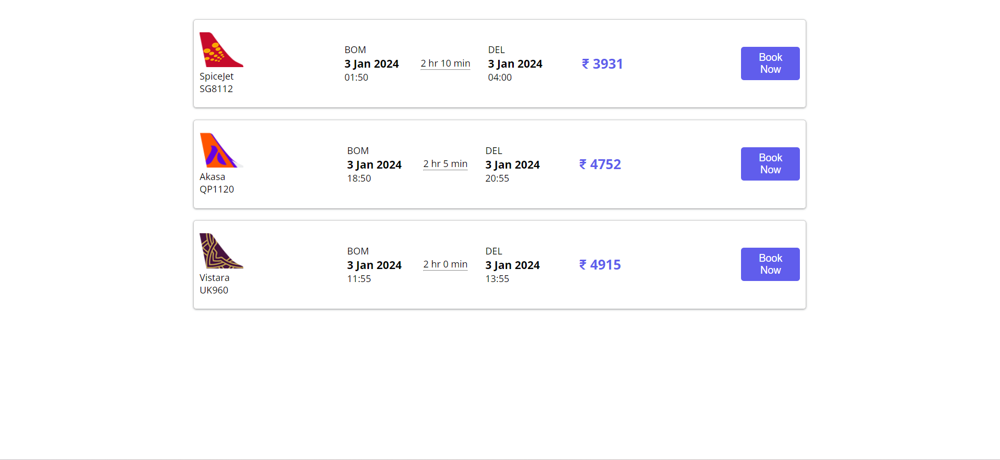
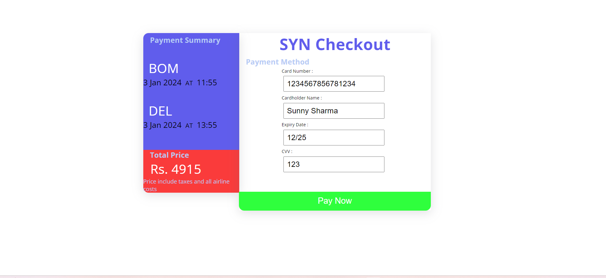
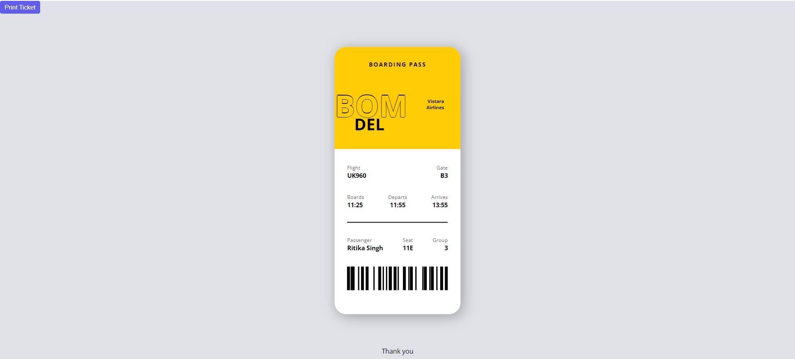
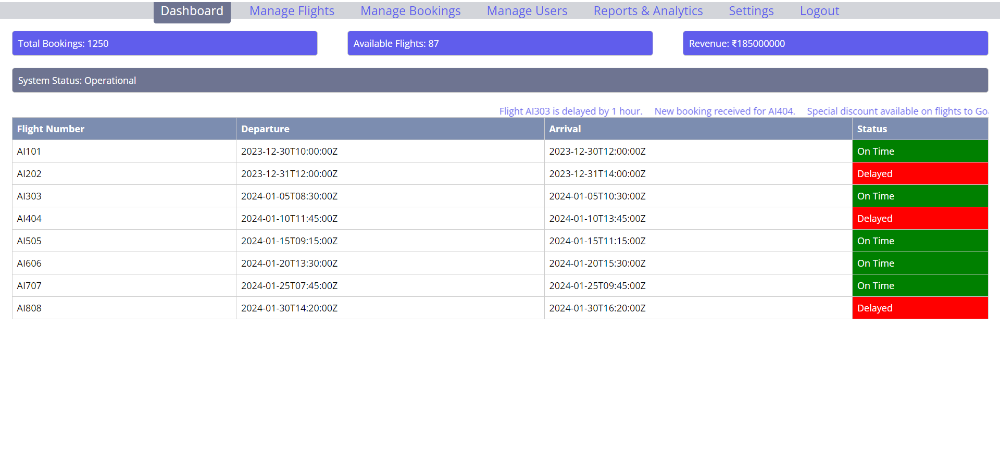
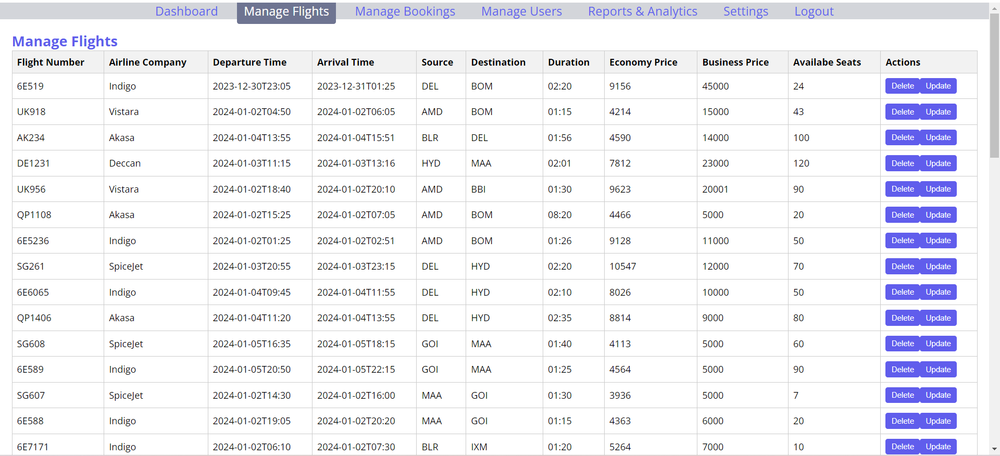
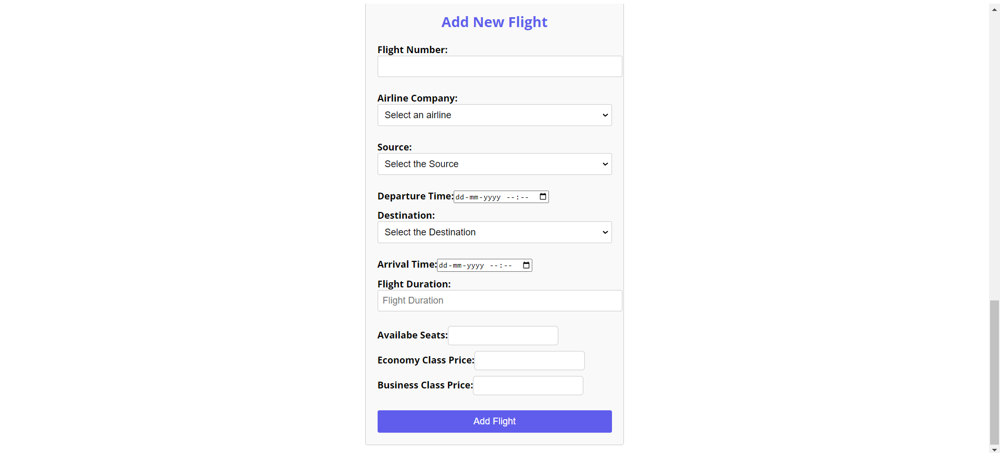
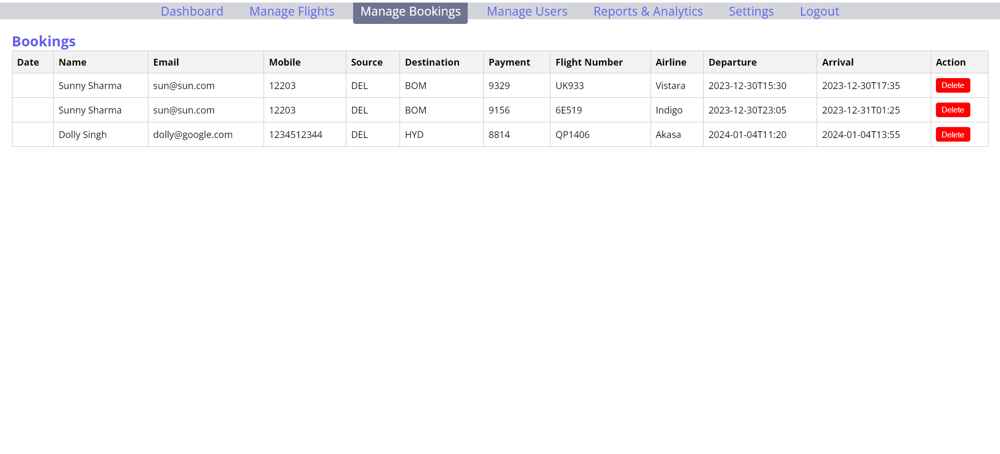
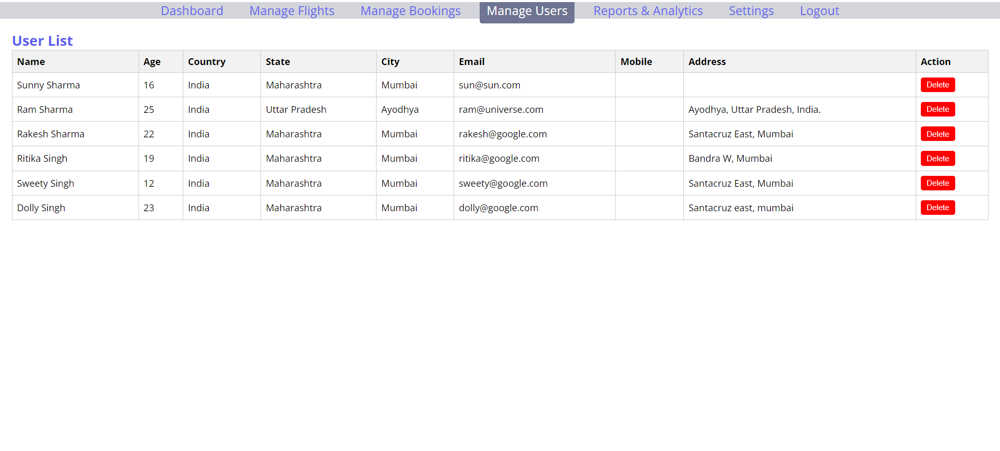

## Contributors

- Sunny Sharma https://github.com/the-Sunny-Sharma
## License

This project is licensed under the MIT License - see the [LICENSE](LICENSE) file for details.
